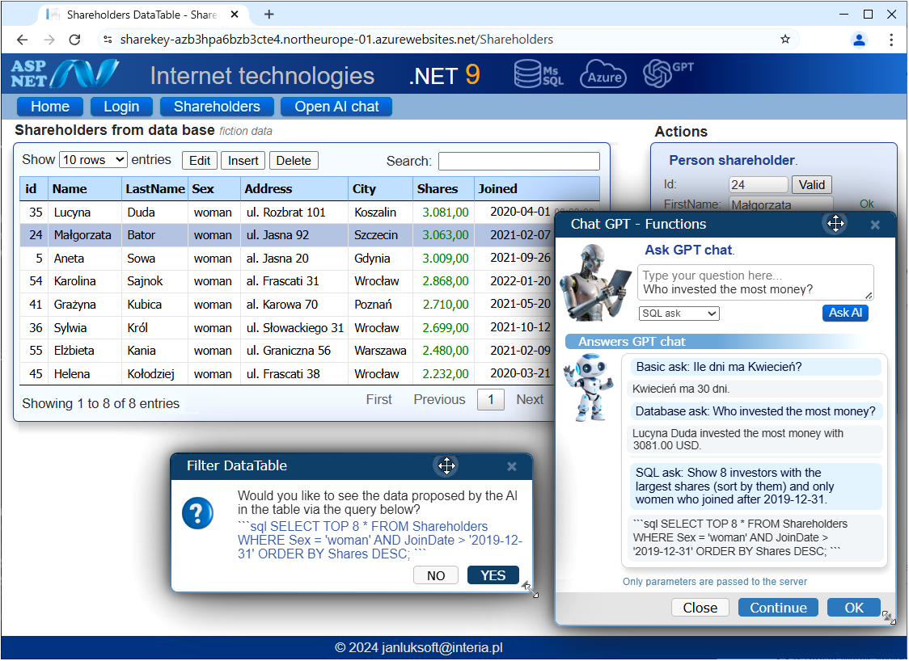
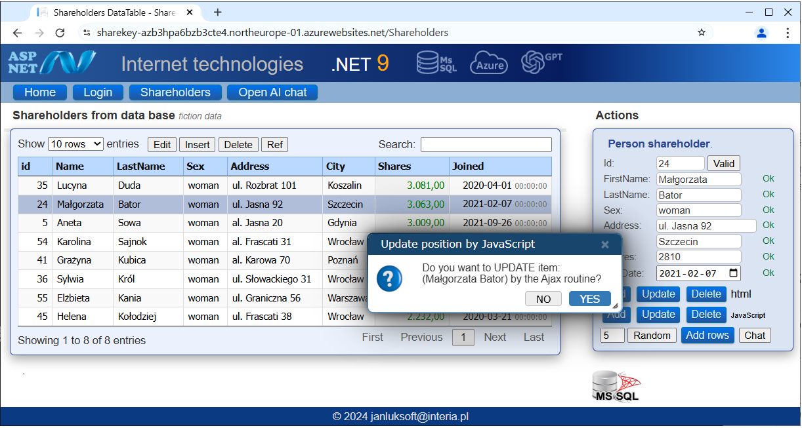

# Technique OpenAI - Function Calling.	

## Overview: Function Calling

The OpenAI service enables interactions between the user and AI. There are several forms of communication, a rather interesting solution is Function Calling.

Function Calling (Tool Use) AI can "call" a backend function when needed. Instead of just answering with text, AI can trigger code — like getting database details, weather, etc.	Azure OpenAI already supports this! You just define a list of functions and their descriptions in the prompt.

🔹 Advantages:
 - You keep conversations natural.
 - Users don’t need to know commands.
 - AI helps decide when to call backend functions.

## Techniques used in the program

A program based on .NET 9, MVC and Entity Framework. It uses a dynamic, nice-looking DataTable and uses my own sliding windows serving as messages. One of such windows is my stand-alone GPT chat.

## Program functionality

The original program is de facto a <b>chat GPT written by me in a web browser</b>. 

In principle and function, it is very similar to the original GPT chat. However, it has the RAG (Retrieval-Augmented Generation) and Function Calling functionality;

They allow not only for "text conversation" but also for operating on the database and controlling its display by asking common questions by the user. Then the user receives a powerful tool and without even knowing any SQL queries, he can obtain the same with the appropriate questions.

## Technical details

The heart of the program is the OpenAImController controller, which accepts a query from the client, processes it and returns the answer. The main function AskQuestionAjax returns the answer from AI to the user's question. Triggers different types of actions depending on the askType. You must use an Azure account and a configured OpenAI service. AI returns a SQL query proposal formatted by itself. After the user agrees, the query proposal returns back to the controller using the GetShareholdersBySql function.

For security reasons, you cannot use a SQL query directly from www. Therefore, GetSQLCreateFromProposal analyzes the proposals, extracts parameters from them and creates an SQL query itself. Next, GetShareholdersBySql executes this query via EF and returns a filtered list to the www page. There, Ajax clearly displays this list in the DataTable.

